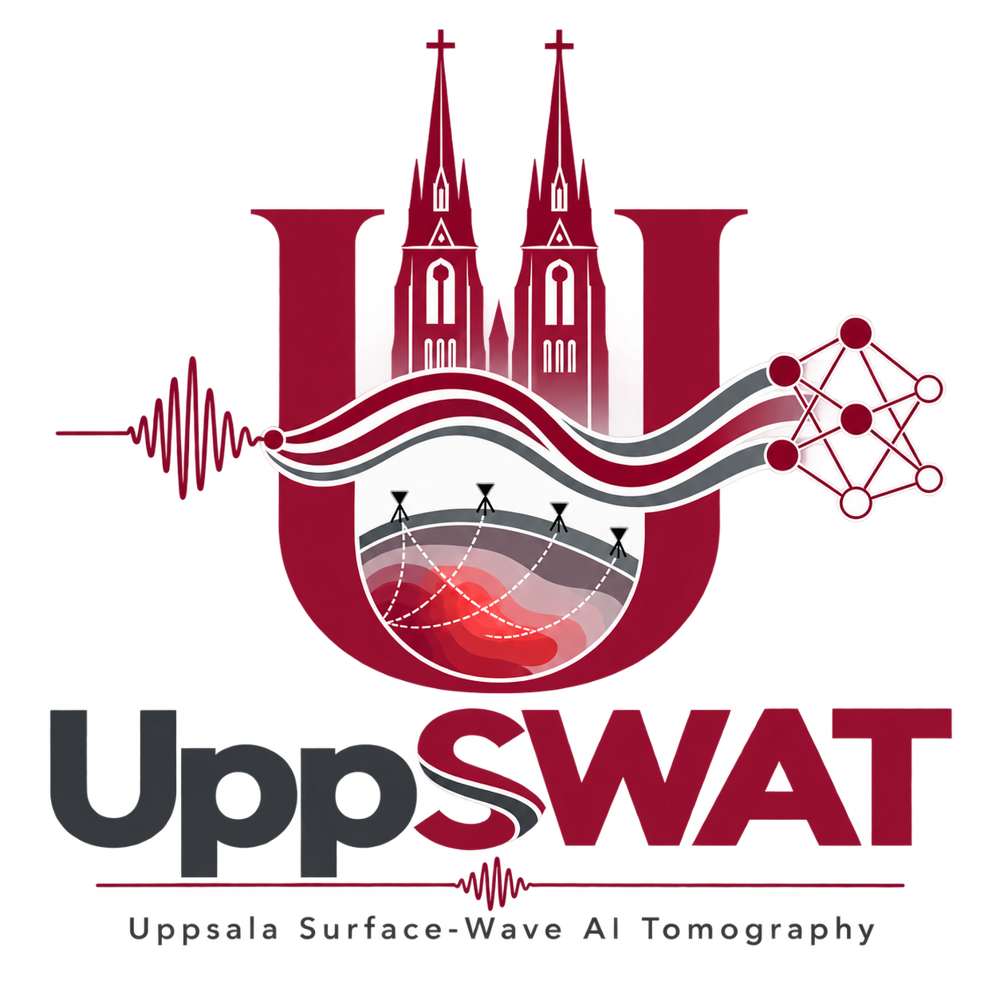
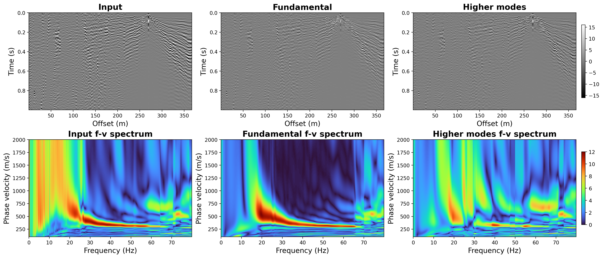
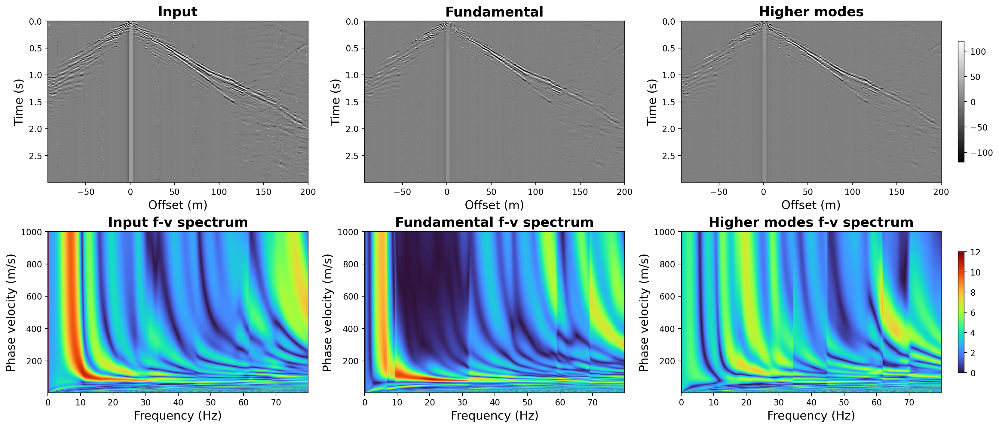

  

## UppSWAT: An Interactive Deep-Learning Software for Surface-Wave Processing and Tomography

  <a href="https://github.com/cuiyang512" target="_blank">Yang Cui1</a> &emsp; 
  <a href="https://www.jsg.utexas.edu/researcher/yangkang_chen/" target="_blank">Yangkang Chen2</a> &emsp;
  <a href="https://www.uu.se/en/contact-and-organisation/staff?query=N19-37" target="_blank">Christian Schiffer1</a> &emsp;
  <a href="https://www.uu.se/en/contact-and-organisation/staff?query=N18-827" target="_blank">Ayse Kaslilar1</a> &emsp;
  <a href="https://www.uu.se/en/contact-and-organisation/staff?query=N21-2074" target="_blank">Myrto Papadopoulou1</a>

  1Department of Earth Sciences, Uppsala University 
  2Bureau of Economic Geology, The University of Texas at Austin 

  
  
  
  

## Overview
UppSWAT is an interactive, deep-learning-based software framework for surface-wave mode separation, processing, and inversion. The mode-separation module is built on an unsupervised deep-learning framework and can process an individual shot gather within a few minutes on a CPU. After separating different surface-wave modes in the space–time domain, UppSWAT further integrates multimodal surface-wave inversion to provide an end-to-end workflow from data processing to subsurface imaging. Our results demonstrate that the separated modal components can improve the quality and reliability of subsurface imaging.

Numerous deep-learning methods have been developed for a wide range of seismic processing and interpretation tasks. However, their practical adoption in both academia and industry remains limited, primarily because of insufficient generalizability and the lack of user-friendly tools. To address these challenges, we propose UppSWAT, an interactive and user-friendly software framework for surface-wave processing and inversion. UppSWAT improves generalizability by incorporating user-provided dispersion information into the deep-learning workflow through interactive guidance, allowing the model to adapt to different datasets without requiring predefined labels. Computational efficiency is further improved through a lightweight U-Net architecture, which provides a robust and computationally efficient backbone for the proposed unsupervised learning framework. Together, these features make UppSWAT a practical bridge between deep-learning research and real-world surface-wave processing applications.

## ModeSep Results

  

  

